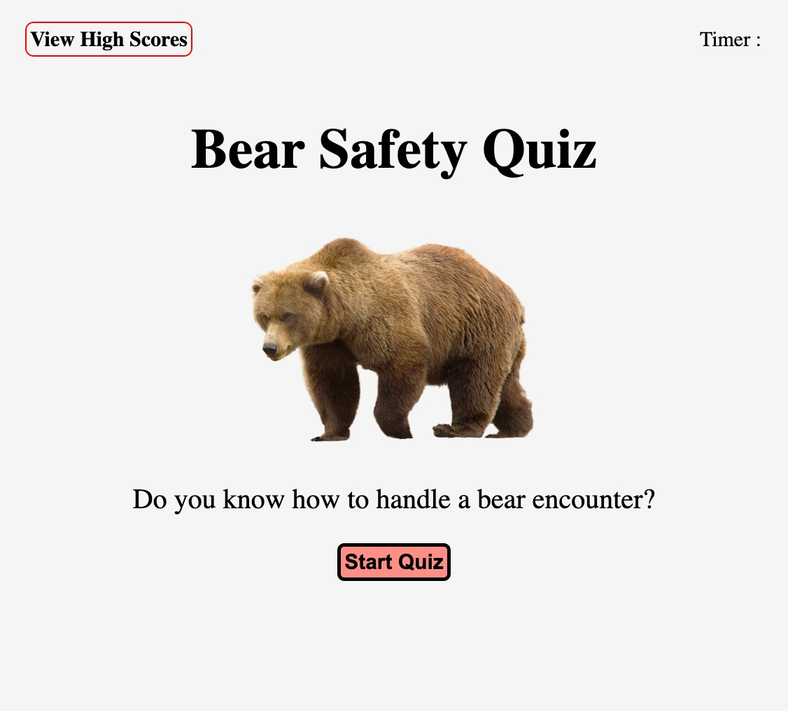

# Code Quiz

 

## Description

This project was created so that a user would be presented with a start page for a quiz. Upon starting the quiz, the user will be timed to answer the presented questions. If the user selects the wrong answer, then they will be penalized with a time reduction. Upon completion of the quiz, or if time runs out, the user can submit their name/initials and score. Additionally, the user can see other scores from other users. The quiz was made entirely from scratch by me, the author. This project was very interesting and challenging to create. I decided to use multiple HTML, CSS, and JavaScript files to complete this project. I learned so much about linking the files to each other and executing that task the way I wanted to. Additionally, I developed my knowledge and skill level with various JavaScript components. It was a challenge to go from understanding those JavaScript components individually to knowing how and when to put them together. I used various documentation along with trial and error until I was able to complete all tasks. This was a very rewarding project to complete.

 

## Technology Used

- HTML - used to edit the existing elements.
- CSS - used to edit the styling for the html elements.
- Javascript - used to add function the application.
- Git - used to track edits made to the source code.
- GitHub - used to host and deploy the repository.

 

| Technology Used         | Resource URL           | 
| ------------- |-------------| 
| JavaScript Objects  | [https://www.w3schools.com/js/js_objects.asp](https://www.w3schools.com/js/js_objects.asp) | 
| Document: querySelector() method    | [https://developer.mozilla.org/en-US/docs/Web/API/Document/querySelector](https://developer.mozilla.org/en-US/docs/Web/API/Document/querySelector)      |   
| EventTarget: addEventListener() method | [https://developer.mozilla.org/en-US/docs/Web/API/EventTarget/addEventListener](https://developer.mozilla.org/en-US/docs/Web/API/EventTarget/addEventListener)     |    
 | JavaScript Functions  | [https://www.w3schools.com/js/js_functions.asp](https://www.w3schools.com/js/js_functions.asp) | 
| Window setInterval() | [https://www.w3schools.com/jsref/met_win_setinterval.asp](https://www.w3schools.com/jsref/met_win_setinterval.asp) | 
| Event: preventDefault() method  | [https://developer.mozilla.org/en-US/docs/Web/API/Event/preventDefault](https://developer.mozilla.org/en-US/docs/Web/API/Event/preventDefault) | 
| Window localStorage  | [https://www.w3schools.com/jsref/prop_win_localstorage.asp](https://www.w3schools.com/jsref/prop_win_localstorage.asp) | 

 

## Deployment

Website URL: * [Code Quiz](https://laineycreighton.github.io/code-quiz/)

Navigating to the website URL should present you with the following:

  
   

## Author Info

### Lainey Creighton

*Currently a student in the UC Berkley Full Stack Flex Bootcamp. Contact Below:* 

* [Portfolio](https://laineycreighton.github.io/portfolio/)
* [LinkedIn](https://www.linkedin.com/in/lainey-creighton/)
* [Github](https://github.com/laineycreighton)

 

## License

N/A